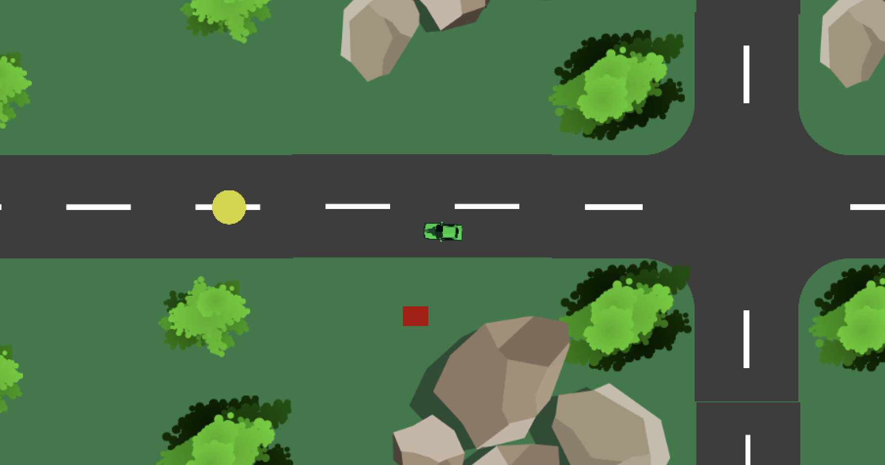
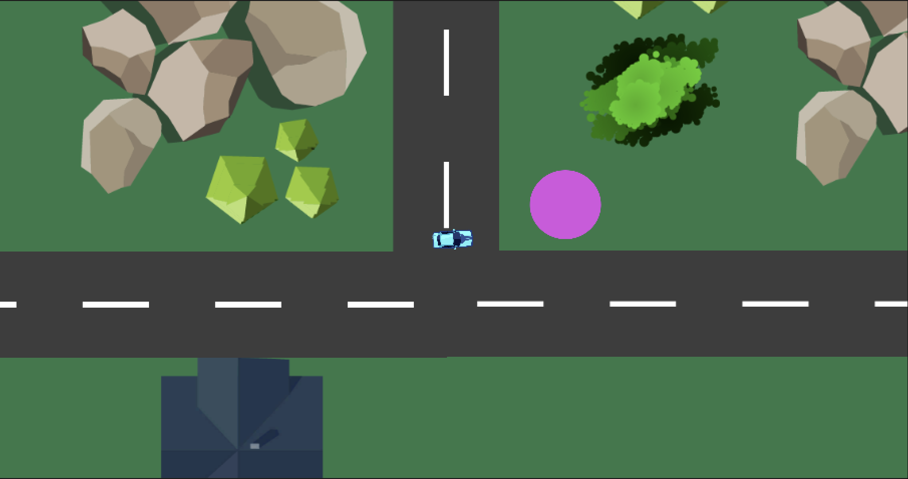

# 🚗 Unity 2D Car Delivery Game

A beginner-friendly 2D car delivery game built in **Unity** as part of the **GameDev.tv** course curriculum. This project demonstrates core Unity concepts including player movement, camera following, collision detection, package pickup/delivery mechanics, and visual feedback.




---

## 🎮 Features

- **Player-controlled car** with realistic steering and speed control
- **Dynamic camera** that follows the player smoothly
- **Package pickup system**: collect packages from spawn zones
- **Delivery system**: drop off packages to customers
- **Visual feedback**: car color changes based on package status
- **Power-ups**: drive through boost zones for temporary speed increase
- **Collision response**: slow down on impact with obstacles

---

## 🛠️ Tech Stack

- **Engine**: Unity (2D)
- **Language**: C#
- **Key Components**:
  - `Rigidbody2D` & `Collider2D` for physics
  - `Input.GetAxis()` for smooth controls
  - `OnTriggerEnter2D` / `OnCollisionEnter2D` for interaction logic
  - `SpriteRenderer` for visual state changes

---

## 📁 Project Structure

```
.
├── Assets/
│   ├── Scripts/
│   │   ├── FollowCamera.cs      # Camera follows the player
│   │   ├── Driver.cs            # Car movement and speed control
│   │   └── Delivery.cs          # Package pickup & delivery logic
├── picture/
│   ├── 1.png                    # Screenshot 1
│   └── 2.png                    # Screenshot 2
└── README.md
```

---

## 🧪 How to Run

1. Clone or download this repository
2. Open the project folder in **Unity Hub**
3. Ensure you're using a compatible Unity version (2021 LTS or newer recommended)
4. Open the main scene (usually `Assets/Scenes/SampleScene.unity`)
5. Press ▶️ **Play** in the Unity Editor

> 💡 Make sure your player object has the **"Player"** tag, and interactable objects are tagged as **"Package"**, **"Customer"**, or **"Boost"**.

---

## 📚 Learning Context

This project was created while following a **GameDev.tv** course on Udemy — a highly-rated training program that has helped over **1 million students** learn game development.

> *"Learn to make video games with the world’s most loved game dev school."*

By building this game, I practiced:
- Object tagging and layer-based interactions
- Transform manipulation (`Translate`, `Rotate`)
- Event-driven programming with Unity colliders
- Visual state management using `SpriteRenderer`
- Basic game design patterns (pickup → deliver loop)

---

## 📄 License

This project is for **educational purposes** and based on course materials from GameDev.tv.  
Feel free to use it as a reference or learning resource!

---

> Made with ❤️ and Unity 🎮  
> Inspired by **GameDev.tv Team** – [Udemy Instructor Partner](https://www.udemy.com/user/gamedevtv/)
